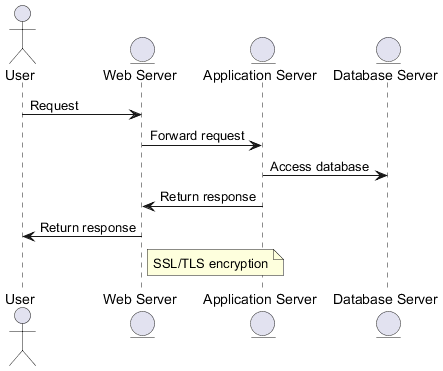
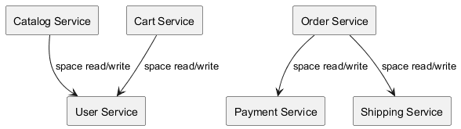
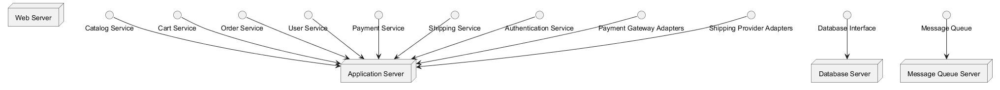
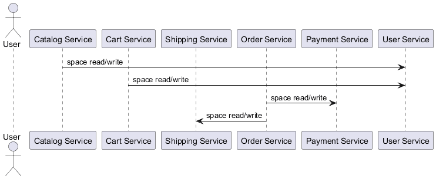
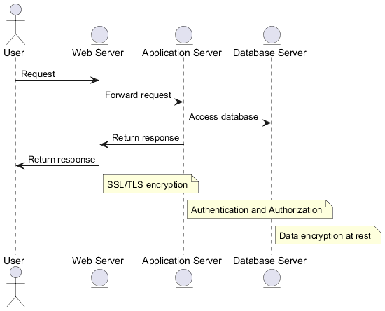

# Documentazione Architetturale

---

## 1. Introduzione

La presente documentazione descrive in modo completo l’architettura di un sistema progettato per operare in un contesto ad alta variabilità di carico, con requisiti stringenti in termini di scalabilità, sicurezza, affidabilità e manutenibilità.

L’obiettivo è fornire una descrizione architetturale strutturata conforme ai principi IEEE 1016.

---

## 2. Contesto e Problema

Il sistema deve sostenere utenti concorrenti, transazioni sicure e integrazione con sistemi esterni garantendo scalabilità e resilienza.

---

## 3. Requisiti Funzionali

- Gestione catalogo prodotti
- Ricerca e filtraggio
- Gestione carrello
- Creazione ordini
- Integrazione pagamenti
- Integrazione spedizioni
- Gestione account utente

---

## 4. Trade-Off Architetturali

Performance vs Complessità

Disponibilità vs Costi

Sicurezza vs Performance

---

# SEZIONE DIAGRAMMI

---

## 5. Diagramma del Contesto

Il diagramma del contesto rappresenta il sistema come **black-box** e mostra gli attori/sistemi esterni con cui interagisce. È utile per chiarire **confini**, **responsabilità** e integrazioni con provider esterni (es. pagamenti e spedizioni).

---

## 6. Diagramma dei Componenti

Il diagramma dei componenti mostra la scomposizione logica del sistema in servizi/moduli. Nel caso corrente sono presenti i seguenti elementi principali:

- Catalog Service
- Cart Service
- Order Service
- User Service
- Payment Service
- Shipping Service

Le dipendenze principali (parziali) sono:
- Catalog Service → User Service (space read/write)
- Cart Service → User Service (space read/write)
- Order Service → Payment Service (space read/write)
- Order Service → Shipping Service (space read/write)

---

## 7. Diagramma del Deployment

Il diagramma di deployment rappresenta la distribuzione fisica dei componenti su nodi infrastrutturali (es. web/app/database). Serve a evidenziare **separazione dei livelli**, scalabilità e isolamento dei failure. È utile anche per discutere aspetti di rete, bilanciamento e fault tolerance.

---

## 8. Diagramma di Sequenza

Il diagramma di sequenza descrive il comportamento dinamico del sistema, evidenziando l’ordine temporale delle interazioni tra attore e servizi. In un contesto e-commerce tipicamente include: consultazione catalogo, gestione carrello, creazione ordine, pagamento e avvio spedizione.

---

## 9. Diagramma di Sicurezza

Il diagramma di sicurezza evidenzia i principali confini di fiducia (trust boundaries) e le misure di protezione: TLS in transito, autenticazione/autorizzazione, validazione input, logging e auditing. È utile per ragionare su threat model e punti critici (pagamenti, dati utenti).

---

## 10. Conclusioni

L’architettura **Microservices Architecture** rappresenta una soluzione equilibrata tra scalabilità, sicurezza e manutenibilità, fornendo una base solida per evoluzione futura.
